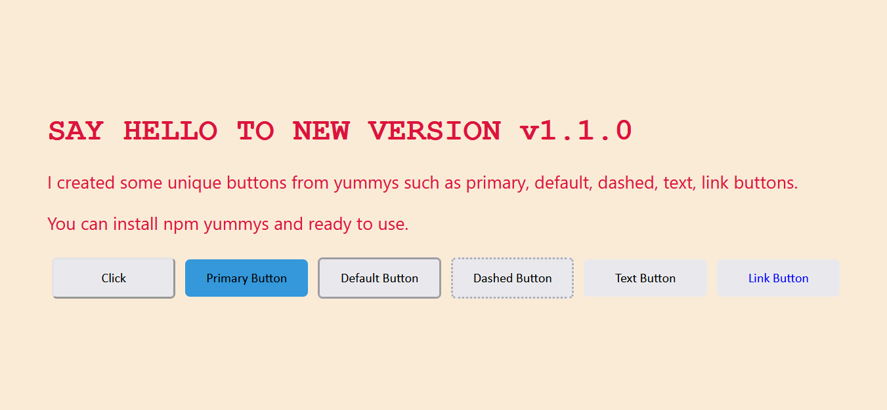

# yummys



> Made with create-react-library

[](https://www.npmjs.com/package/yummys) [](https://standardjs.com)

## Install

```bash
npm install --save yummys
```

## Usage

```jsx
import React, { Component } from 'react'

import Yummys from 'yummys'
import 'yummys/dist/index.css'

class Example extends Component {
  render() {
    return <Yummys />
  }
}
```

## License

MIT © [m1erla](https://github.com/m1erla)
